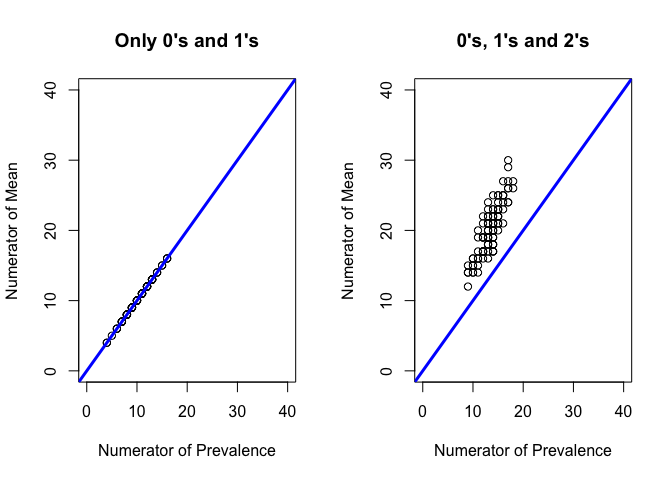
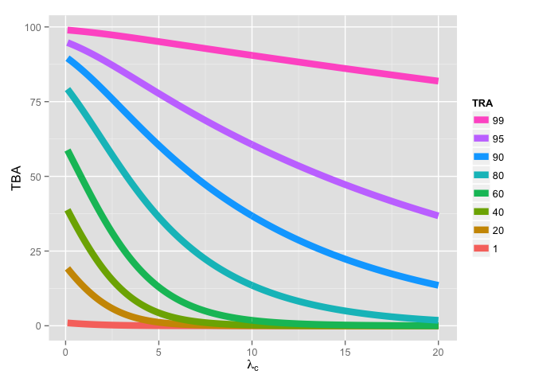

# Why Model TBA and TRA?
Bruce Swihart  
April 16, 2015  

Standard Membrane Feeding Assay (SMFA) is a process to yield oocysts of a parasite within the midgut of a mosquito, often used in malaria vaccine experiments.  Well, several mosquitoes at a time, in different containers of different feeds.  The process involves and depends on the preparation of good, consistent controls, from which a treatment effect will be tested.  Good, consistent controls are essential to establsih before testing anything that might alter the number of oocysts.  Basically, we need to establish/know/reduce/standardize the noise of the processso that we can attempt to find the signal of a test.  In SMFA, the background noise is the variation of oocysts produced across mosquitoes under control conditions, which means 0 units of treatment dose to attempt to reduce the number of oocysts produce by parasite in the midgut of mosquitos.

For simplicity, let's say one pint of one feed containing 0 micrograms of dose is administered to 20 mosquitoes and in a separate container with the same the feed and 94 micrograms of dose is administered to a distinct set of 20 mosquitoes. So, 40 mosquitoes total, 20 receiving placebo, 20 receiving treatment.

What measures are available for us to convey how effective the treatment was concerning the number of oocysts?

There are two commonly used:  transmission-reducing activity (TRA) and  transmission-blocking activity (TBA).  If $\mu_t$ is the mean oocysts of the treatment group, $\mu_c$ is the mean oocysts of the control group, $p_t$ is the proportion of the treament group mosquitoes with 1 or more oocysts, $p_c$ is the proportion of the control group mosquitoes with 1 or more oocysts, then

  * TRA = $100(1 - \frac{\mu_t}{\mu_c} )$
  * TBA = $100(1 - \frac{p_t}{p_c} )$

The form for both measures is :

  * TBA = $100(1 - \frac{num}{den} )$
  
So the differences between TRA and TBA boil down to the differences of $\mu$ vs $p$.  

  * $\hat{\mu}$ = $\sum y_i / 20$
  * $\hat{p}$   = $\sum 1_{\{y_i > 0\}} / 20$
  
Since both $\hat{\mu}$ and $\hat{p}$ have the same denominator, we can drill down our focus to the numerators.  After rewriting the numerator of $\hat{\mu}$ we have

  * Numerator of Mean $\hat{\mu}$ = $\sum y_i 1_{\{y_i > 0\}}$
  * Numerator of Prevalence $\hat{p}$   = $\sum 1_{\{y_i > 0\}}$

  
If $y_i$ is the number of oocysts in mosquito $i$, then $y_i$ is an integer, $0, 1, 2, \dots$.  If $y_i$ can only be $0$ or $1$, then the mean and prevalence will be the same.  However, if it can be $0$, $1$, or $2$, then the mean will always be greater than or equal to the prevalence.  See the graphs below comparing the numerator of the mean to the numerator of the prevalence: 

 

In practice, the number of oocysts from a mosquito can be quite large, so it stands to reason that in practice the mean is always going to be larger than the prevalence.  However, for the TRA and TBA, they depend on the ratio of two means (or prevalences) and because of that it is possible to have TRAs bigger or smaller than TBAs.  If the treatment group mean oocysts is bigger than the control group mean oocysts, then the TRA is negative.  Similarly for the TBA and the relative magnitude of treatment group and control group prevalences.  Below is two plots showing how noisy the measurements can be.  100 samples of size 20 for the controls and size 20 for the treatment where each group has the same mean from a discrete uniform.  The left plot the mean is 1; the right plot the mean is 10.

 

Empirically, the distribution of oocysts is likely not discrete uniform.  Intuitively the TRA and TBA have a relation.  Describing the relation explicitly is difficult using only the empirically observed data from an SMFA.  However, if one allows the assumption that the data follow a distribution, we can 1) explicitly write the TRA-TBA relation; and, 2) test the assumption of "goodness of fit" of the assumed model to the data and quantify said goodness-of-fit.

For motivating purposes, we will go through a motivating example using a Poisson distribution.  

Assume the population treatment group mean oocysts is $\lambda_t$ and likewise assume the population control group mean oocysts is $\lambda_c$ and that the distribution of oocysts are described well by the Poisson distribution.  These assumptions allow us to state the following:

  *  Population TRA: $100(1 - \frac{\lambda_t}{\lambda_c} )$
  *  Sample TRA:     $100(1 - \frac{\overline{y_t}}{\overline{y_c}} )$

  *  Population TBA: $100(1 - \frac{\exp(-\lambda_t)}{\exp(-\lambda_c)} )$
  *  Sample TBA:     $100(1 - \frac{\overline{1_{y_t > 0}}}{\overline{1_{y_c>0}}} )$

If we solve the population TRA for $\lambda_t$, we can get an explicit relation for TRA and TBA (assuming the distribution of oocysts follows a Poisson distribution):

*  Population TBA: $100(1-\frac{\exp(-\lambda_c(1-\frac{ {\rm TRA}}{100}))}{\exp(-\lambda_c)} )$

Here is a plot that depicts the relation for population TBA as a function of the control mean for different values of population TRA:

 

Quite clearly, the TRA-TBA relation depends on the control mean.

Now, of the three variables TRA, TBA, and the control mean there is one that is capable of being changed, an "independent variable", if you will -- the control mean.  A lab can **target** a control mean.

However, the sample control mean may differ from the **target** control mean, and this introduces uncertainty into the TRA-TBA relation:

 

